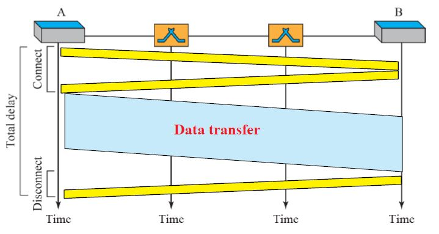
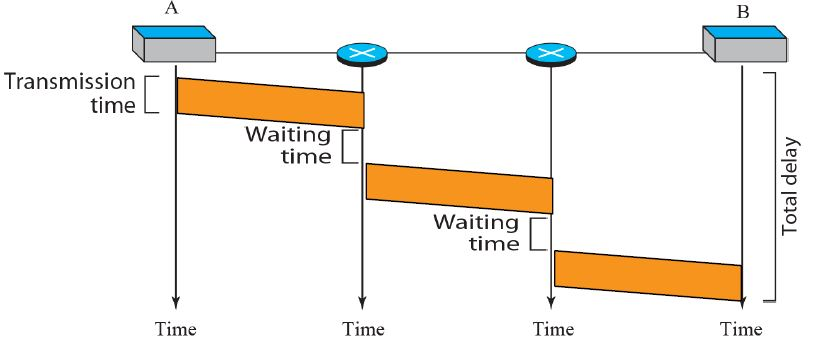
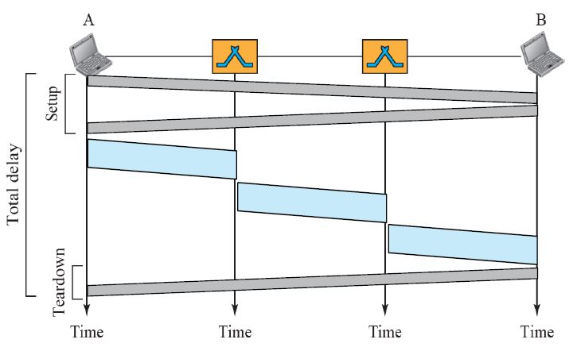

# 2018-10-16-Switching

# Switching

- Circuit switching
- Packet switching
    - Virtual-circuit approach
    - Datagram approach
- Message switching

## Circuit-switched network

connected by physical links

- Setup phase
    - dedicated circuit
    - Resources: such as channel (bandwidth in FDM and time slots in TDM), switch buffers, switch processing time, and switch input/output ports 할당
- Data-transfer phase
    - No addressing
- Teardown phase(disconnect)

장점 : 연결되어 있을때 Delay 가없음.
단점 : 효율적이지 않음. 빈데이터가 있어도 연결돼있음.

## Packet-switched network

- No resource allocation
- No reserved bandwidth
- No scheduled processing time

Lack of reservation may create delay

### Datagram network

서로 다른 길로 들어와서 TCP가 재정렬함.

No setup or teardown phases.

Routing Table 생성

Every packet in a datagram network carries a header that contains the destination address of the packet.

virtual-circuit network보단 delay가 적다.

### Virtual-Circuit Networks

Setup and teardown phases + Data transfer phase

Same path

Virtual-Circuit Identifier (VCI)

All switches need to have a table entry for this virtual circuit.
Each switch changes the VCI and routes the frame.

Setup request frame 이 Routing table로 따라 보내면 Acknowledgment Frame이 돌아오면서 VCI를 설정해줘서 switching table이 만들어진다.

