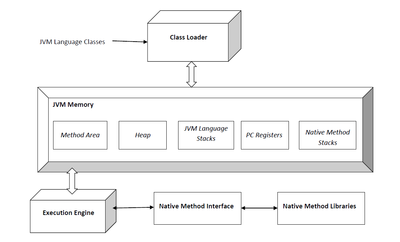

# 2019-11-15-JAVA

# JAVA

이 게시물은 [t](http://tcpschool.com/java)[cp school 사이트](http://tcpschool.com/java/intro), Do it! 자바 프로그래밍 입문(박은종) 을 공부한 내용으로 쓰였습니다.

## 특징

자바는 대표적인 객체지향프로그래밍 언어입니다. ’Write once, run anywhere’라는 슬로건을 내새우며 플랫폼에 종속되지 않는 프로그램을 개발합니다. c/c++은 같은소스라도 윈도우, 리눅스 등 OS(플랫폼)에 따라 실행파일을 다르게 컴파일해서 배포해야한다. 반면, 자바는 자바 가상 머신(JVM)이라는 스택기반의 가상머신이 존재한다. JVM은 자바와 OS사이의 중개자 역할을 하여 자바 컴파일러가 생성한 바이트 코드를 OS에 영향을 받지 않고 실행가능하게 해줍니다. c와 달리 동적 메모리에 직접 접근을 할수 없고, 메모리 수거를 자동으로 해주는 Garbage Collector를 이용한다.

`JVM`

자바프로그램은 JVM이라는 자바가상머신 위에서 동작한다. JVM은 OS마다 그리고 버전마다 다르게 만들어져있기 때문에 JAVA 프로그래머는 같은 프로그램 코드로 다른 환경에서 같은 동작을 시킬 수 있습니다.

JDK(Java Development Kit)는 자바코드를 개발할 때 필요한 도구로 JRE(Java Runtime Environment)와 Java 바이트코드 컴파일러, Java 디버거 등으로 이뤄져있습니다.

JDK 종류는 크게 둘로 나뉘는데 Oracle JDK는 상업적 이용을 목적으로 할 경우 유료입니다. OpenJDK는 Oracle사에서 지원하는 GPL 라이선스 JDK입니다. 하지만 6개월마다 메이저버전이 바뀌며 지원이 종료됩니다.

JDK는 자바 컴파일러를 통해 자바 클래스파일(.java)를 자바 바이트 코드(.class)로 컴파일 하고 클래스 로더로 JVM에 로딩한다.

자바 가상머신은 바이트 코드를 읽고 해석하는 1. 자바 인터프리터, 동적으로 자바 클래스를 읽어오는 2. 클래스 로더, 런타임에 실제 기계어로 변환해주는 3. JIT(Just-In-Time) 컴파일러, 사용하지 않는 메모리를 회수하는 4. 가비지 컬렉터로 구성되어있습니다.

[https://docs.oracle.com/javase/specs/jls/se8/html/index.html](https://docs.oracle.com/javase/specs/jls/se8/html/index.html)


JVM

[참고](https://asfirstalways.tistory.com/158)

[위키](https://ko.wikipedia.org/wiki/%EC%9E%90%EB%B0%94_%EA%B0%80%EC%83%81_%EB%A8%B8%EC%8B%A0)

## 변수와 자료형

### 변수

변수는  ( = <초기값>); 으로 선언한다

### 이름규칙

- 클래스 이름/인터페이스 이름
    - 첫 글자는 대문자로 표기합니다.
    - 연결된 단어의 첫 글자도 대문자로 표기합니다.
    - 나머지 문자는 소문자로 표기합니다.
    - “$”(dollar sign) 은 내부 클래스에서 특별한 의미가 있기 때문에 사용을 권장하지 않습니다.
- 변수 이름
    - 첫 글자는 소문자, 연결 단어의 첫 글자는 대문자로 표기합니다.
    - 일반적으로 변수 이름에서는 "_"(underscore character) 를 사용하지 않습니다.
- 메서드 이름
    - 동사적 의미를 갖게 합니다.
    - 첫 글자는 소문자, 연결 단어의 첫 글자는 대문자로 표기합니다.
    - 일반적으로 메서드 이름에서는 "_"(underscore character) 를 사용하지 않습니다.

### 자료형

### 기본 데이터 타입

C와 달리 unsigned 자료형이 없음, 음수는 2의 보수를 이용.

| Property            | 유형      | 크기       | 범위                       | 초기값     |
| -------------------- | ------- | -------- | ------------------------ | ------- |
| 정수형 Integral         | byte    | 1 byte   | -2^7 ~ 2^7-1             | 0       |
|                      | short   | 2 byte   | -2^15 ~ 2^15-1           | 0       |
|                      | int     | 4 byte   | -2^31 ~ 2^31-1           | 0       |
|                      | long    | 8 byte   | -2^63 ~ 2^63-1           | 0L      |
| 실수형 Floating - point | float   | 4 byte   | (7자리의 소수)                | 0.0F    |
|                      | double  | 8 byte   | (15자리의 소수)               | 0.0D    |
| 논리형 Logical          | boolean | 1 bit    | true 또는 false (소문자)      | false   |
| 문자형 Textual          | char    | 2 byte   | \u0000 ~ \uFFFF          | 'u0000' |
|                      | String  | variable | 각 위치에서 \0x0000 ~ \0xFFFF | null    |
```java
// <type> <variableName>;
boolean one = false;
char two = 'A';
String three = "ABCDEFG";
```

생성된 String 값(문자열)은 불변(immutable)입니다. 문자열은 힙메모리에 저장되고 다른 문자열을 대입하면 기존의 문자열은 그대로 남아있는채로 새로운 문자열 인스턴스가 생성 됩니다. 문자열 연결을 계속하면 메모리에 garbage가 많이 생길 수 있습니다. 반복문안에서는 StringBuilder와 StringBuffer 클래스를 사용해주는게 좋다.

10버전 부터 사용가능한 var 타입 선언은 초기값을 입력해주면 추론하여 적당한 변수타입을 지정해줍니다. 즉, 초기값이 없으면 에러가 발생합니다.

```java
public class Variable1 {

	public static void main(String[] args) {
		// TODO Auto-generated method stub
		int level;
		level = 10;
		var abc = "10";
		var bbc = '1';
		System.out.println(level);
	}

}
```

| escape type | 의미                   |
| ------------ | -------------------- |
| \n           | New Line(\u000A)     |
| \t           | Tab(\u0009)          |
| \b           | Backspace(\u0008)    |
| \r           | Return(\u000D)       |
| \f           | Form Feed(\u000C)    |
| \\           | Backslash(\u005C)    |
| \’           | Single Quote(\u0027) |
| \”           | Double Quote(\u0022) |
```java
public class BinaryTest {

	public static void main(String[] args) {

			
		int num = 10;
		int bNum = 0B1010;
		int oNum = 012;
		int hNum = 0XA;
		

		System.out.println(num);
		System.out.println(bNum);
		System.out.println(oNum);
		System.out.println(hNum);
		
		byte bs1 = -128;
		byte bs2 = 127;
		System.out.println(bs1);
		System.out.println(bs2);
		
		
		double dnum = 3.14;
		float fnum = 3.14F;
		
		System.out.println(dnum);
		System.out.println(fnum);
		
		int a = 65;
		int b = -66;
		
		char a2 = 65;
		char ch1 = '한';
		
		System.out.println((char)a);
		System.out.println((char)b);
		System.out.println((char)a2);
		System.out.println((char)ch1);
		
	}

}
```

```
10
10
10
10
-128
127
3.14
3.14
A
ﾾ
A
한
```

### 상수

Java에서 상수는 final 키워드(c++의 const 키워드와 같음)를 사용해서 선언합니다. 상수는 선언과 동시에 초기화해야 합니다.

자바에서 상수의 이름은 일반적으로 모두 대문자를 사용하여 선언합니다. 또한, 여러 단어로 이루어진 이름의 경우에는 언더스코어(_)를 사용하여 구분합니다.

```java
final double PI = 3.14;
final int MAX_NUM =100;
```

### 리터럴(literal)

리터럴은 그 자체의 값입니다.

- 정수형
- 실수형
- 논리형
- 문자형
- 문자열
- null

자바에서 기본적으로 정수는 int, 실수는 double형이므로 원하는 타입으로 저장하고 싶을때엔 상수뒤에 리터럴 문자를 써줘야한다. L or l 접미사는 long, F or f는 float형, D or d 는 double형을 나타내는 접미사를 붙여 명시할 수 있습니다.

```java
char ch = 'A';
int num = 10;
final double PI = 3.14F;
long num = 12345678900L;
```

### 형변환(Type conversion)

형변환에는 묵시적 형변환과 명시적 형변환이 있다. 더 정밀한 자료형으로 대입하거나 연산할 때 묵시적 형변환이 일이나고, 프로그래머가 의도적으로 크기가 작은 자료형이나, 덜 정밀한 자료형에 대입하는 경우 명시적 형변환을 사용한다. 이때 자료 손실일 발생할 수 있다.

```java
public class Variable1 {

	public static void main(String[] args) {
		
		byte bNum = 10;
		int iNum = bNum;
		
		System.out.println(bNum);
		System.out.println(iNum);
		
		int iNum2 =20;
		float fNum = iNum2;
		
		System.out.println(iNum);
		System.out.println(fNum);
		
		double dNum;
		dNum = fNum + iNum;
		System.out.println(dNum);

	}
}
```

## 연산자

| Precedence | Type  | Operator             | Property                                                                                                                                       |
| ----------- | ----- | -------------------- | ---------------------------------------------------------------------------------------------------------------------------------------------- |
| 15          | 일차식   | () [] .              | Parentheses, Array subscript, Member selection                                                                                                 |
| 14          | 단항    | ++ --                | Unary post-increment, Unary post-decrement                                                                                                     |
| 13          | 단항    | ++ -- + - ! ~ (type) | Unary pre-increment, Unary pre-decrement, Unary plus, Unary minus, Unary logical negation, Unary bitwise complement, Unary type cast           |
| 12          | 산술    | * / %                | Multiplication, Division, Moduls                                                                                                               |
| 11          | 산술    | + -                  | Addition, Subtraction                                                                                                                          |
| 10          | 비트 이동 | << >> >>>            | Bitwise left shift, Bitwise right shift with sign extension, Bitwise right shift with zero extension                                           |
| 9           | 관계    | < <= > >= instanceof | Relational less than,Relational less than or equial, Relational greater than, Relational greater than or equal, Type comparison (objects only) |
| 8           | 관계    | == !=                | Relational is equial to, Relational is not equal to                                                                                            |
| 7           | 비트 곱  | &                    | Bitwise AND                                                                                                                                    |
| 6           | 비트 차  | ^                    | Bitwise exclusive OR                                                                                                                           |
| 5           | 비트 합  | |                    | Bitwise inclusive OR                                                                                                                           |
| 4           | 논리 곱  | &&                   | Logical AND                                                                                                                                    |
| 3           | 논리 합  | ||                   | Logical OR                                                                                                                                     |
| 2           | 조건    | ? :                  | Temary conditional                                                                                                                             |
| 1           | 대입    | = += -= *= /= %=     | Assignment, Addition aaignment, Subtraction assignment, Multiplication assignment, Division assignment, Modulus assignment                     |
단락 회로 평가 (short circuit evaluation)

- 논리 AND(`&&`) 앞의 항이 false 이면 뒤 항의 결과 값과 상관없이 false
- 논리 곱(`||`) 앞의 항이 true 이면 뒤 항의 결과 값과 상관없이 true

```java
public class OperationEx3 {

	public static void main(String[] args) {
		
		int num1 = 10;
		int num2 = 20;
		
		boolean flag1 = (++num1 == 10) || (num2++ == 20);
		System.out.println("num1 : " + num1);
		System.out.println("num2 : " + num2);
		System.out.println("flag1 : " + flag1);
		// 거짓 || 참
		
		boolean flag2 = (num1++ == 10) && (++num2 == 20);
		System.out.println("num1 : " + num1);
		System.out.println("num2 : " + num2);
		System.out.println("flag2 : " + flag2);
		// 거짓 && (참 : 실행안함)
	}
}
```

## 조건문과 반복문

## 클래스와 객체

클래스는 멤버변수와 메서드로 이루어진 하나의 **도면**이다. 이러한 클래스기반의 프로그래밍을 객체지향 프로그래밍이라고한다.

클래스를 사용하기위해 생성하는 방법

```java
//클래스형 변수이름 = new 생성자;
Student studentJimin = new Student();
```

이 때 실제로 사용할 수 있도록 생성된 클래스를 `인스턴스`라고 한다. Student 클래스 자료형으로 studentJimin 변수를 선언하고 new Student();로 Student 클래스를 생성하여 studentJimin에 대입한다는 뜻이다. studentJimin을 참조변수라고 하고, 이변수가 생성된 인스턴스를 가리킨다.

인스턴스는 힙영역에 생성된다. 힙은 동적으로 할당되며 자바는 가비지 컬렉터가 자동으로 메모리를 해제해 준다.

생성자

자바컴파일러는 다음과같이 디폴트 생성자를 자동으로 만들어준다.

```java
public class Person{
	String name;
    float height;
    float weight;
  

	public Person() {} //자바 컴파일러가 제공하는 디폴트 생성자
}
```

프로그래머가 직접 생성자를 구현하려면 다음과같다. 단, 생성자를 하나이상 구현하면 디폴트 생성자는 만들어지지 않는다. 생성자는 오버로드가 가능하다.

```java
public class Person{
	String name;
    float height;
    float weight;
  

	public Person(String pname) {
        name = pname;
    }
}
```

참조자료형

크기가 정해진 기본자료형(int,char, float, double 등)으로 선언하는 변수가 있고, 클래스 자료형으로 선언하는 참조 자료형 변수가 있다.

정보은닉

public

protected

private

this예약어

- 자신의 메몰를 가리키는 this
- 생성자에서 다른 생성자를 호출하는 this
- 자신의 주솔르 반환하는 this

static 변수

클래스에서 공통으로 사용하는 변수를 `static`으로 선언한다. 이변수는 다른멤버 변수처럼 인스턴스가 생성될 때마다 새로 생성되는 변수가 아니고, 딱 한번 메모리 공간이 할당되고 모든 인스턴스가 공유한다.

| 변수 유형            | 선언 위치                       | 사용 범위                                              | 메모리    | 생성과 소멸                                                      |
| ----------------- | --------------------------- | -------------------------------------------------- | ------ | ----------------------------------------------------------- |
| 지역 변수(로컬 변수)      | 함수 내부에 선언                   | 함수 내부에서만 사용                                        | 스택     | 함수가 호출될 때 생성되고 함수가 끝나면 소멸함                                  |
| 멤버 변수(인스턴스 변수)    | 클래스 멤버 변수로 선언               | 클래스 내부에서 사용하고 private이 아니면 참조 변수로 다른 클래스에서 사용 가능   | 힙      | 인스턴스가 생성될 때 힙에 생성되고, 가비지 컬렉터가 메모리를 수거할 때 소멸됨                |
| static 변수(클래스 변수) | static 예약어를 사용하여 클래스 내부에 선언 | 클래스 내부에서 사용하고 private이 아니면 클래스 이름으로 다른 클래스에서 사용 가능 | 데이터 영역 | 프로그램이 처음 시작할 때 상수와 함께 데이터 영역에 생성되고 프로그램이 끝나고 메모리를 해제할 때 소멸됨 |
static 변수는 라이프타임이 길다. 그러므로 인스턴스로 생성하면 가비지 컬렉터(사용하지 않는 메모리를 회수하는 기능)가 소멸시키기 때문에 메모리가 절약된다.

싱글톤 패턴?

## 배열

배열의 선언 방법은 다음과 같다.

```java
int[] studentID = new int[3];
// 또는 int student[] = new int[3];

int[] studentScore = new int[] {100, 50, 70};
// 또는 itn[] studnetScore = {100, 50, 70};

int[] studentGrade;
studentGrade = new int[] {1, 5, 3};
```

`[]` 는 인덱스 연산자이다. 배열요소가 저장된 메모리 위치를 찾아주는 역할을 한다.

배열은 처음 설정한 값이 전체 배열 길이이다. 실제로 유효한 값의 배열의 크기를 측정하기 위해서는 초기화 할때마다 size를 1씩 증가 시키는 방법이있다.

객체도 마찬가지로 배열로 만들수 있다.

기존 배열은 항상 배열 길이를 정하고 프로그래밍을 해야하기 때문에 동적인 배열을 다루기 힘들었다. 그래서 자바는 객체 배열 클래스 ArrayList 를 제공한다.

ArrayList 클래스의 주요 메서드

| 메서드                | 설명                                       |
| ------------------- | ---------------------------------------- |
| boolean add(E e)    | 요소(객체) 하나를 배열에 추가합니다. E는 요소의 자료형을 의미합니다. |
| int size()          | 배열에 추가된 요소 전체 개수를 반환합니다.                 |
| E get(int index)    | 배열의 index 위치에 있는 요소 값을 반환합니다.            |
| E remove(int index) | 배열의 index 위치에 있는 요소 값을 제거하고 그 값을 반환합니다.  |
| boolean isEmpty()   | 배열이 비어 있는지 확인합니다.                        |
## 상속과 다형성

상속(inheritance)란 유사한 클래스 간의 관계다. 기본베이스가 되는 클래스(상위 클래스)(부모 클래스)가 멤버 변수(속성)이나 메서드(기능)을 추가한 클래스(하위 클래스)(자식 클래스)에게 상속한다고 한다.

```java
class B extends A{
	...
}
```

위 코드는 B클래스는 A클래스의 멤버 변수와 메소드를 상속받는다. …에 B클래스만의 멤버 변수와 메소드를 정의할 수 있다. 단 private 변수는 상속된 클래스에서 접근할 수 없기 때문에 `protected` 예약어 변수를 사용한다. protected는 상속된 하위 클래스를 제외한 나머지 외부 클래스에서는 private와 동일한 역할을 한다.

하위 클래스가 생성될 때는 상위 클래스의 생성자가 먼저 호출된다. `super` 예약어는 하위 클래스에서 상위 클래스로 접근할 때 사용한다.

다음과 같이 하위 클래스는 상위 클래스로 묵시적 형변환이 가능하다. 이러한 형변환을 `업캐스팅`이라고 한다. 업캐스팅된 클래스의 원래 인스턴스의 멤버 변수는 접근이 불가능 하다.(가상 메서드로 접근은 가능)

```java
Customer vc = new VIPCustomer();
//선언된 클래스형 = 생성된 인스턴스의 클래스형
//(상위 클래스형) = (하위 클래스형)
```

반대는 묵시적 형변환이 불가하고 명시적 형변환이 가능하다.

**메서드 오버라이딩**

상위 클래스에서 정의된 메서드를 하위 클래스에서 재정의 하는 것을 `메서드 오버라이딩`이라고 한다. 이때 오버라이드할 메서드 앞에 @Override 애노테이션을 붙여서 재정의된 메서드임을 알린다. 메서드 오버라이딩을 통해 업캐스팅된 클래스에서 원래 인스턴스의 메서드를 접근할 수 있다. 이때 이를 `가상 메서드`라고한다. 이는 클래스를 생성하여 인스턴스가 만들어질 때 멤버변수는 힙 메모리에 위치하는 반면 메서드는 메서드 영역(코드 영역)에 위치한고, 메서드를 호출하면 메서드 영역의 주소를 참조하여 명령이 실행된다. 그래서 업캐스팅 된 클래스는 원래 인스턴스의 가상메서드를 그대로 가져와서 사용한다.

**다형성**

이런 묵시적 형변환(업캐스팅)과 가상 메서드를 통해 객체지향의 특성 `다형성`을 이룬다. 유사한 클래스를 하나의 상위 클래스에서 상속받아서 하나의 자료형으로 쉽게 관리할 수 있다. 이때문에 유지보수한는 데 매우 편리하다.

**다운캐스팅**

상위 클래스로 형변환(업캐스팅)된 인스턴스의 자료형을 원래 자료형으로 돌아갈때 사용하는것이 다운캐스팅입니다. 업캐스팅된 상태에서는 원래 인스턴스만의 멤버변수에 접근할 수 없기 때문에

instanceof

**추상 클래스(abstract)**

실제로 사용하지 않는(완전하지 않은) 상위클래스를 생성하여 메서드를 정의한뒤 하위클래스에 상속하는 방법을 추상클래스라고 합니다. 구현하지 않은 메서드를 상위클래스에 선언하여 하위클래스에서 정의하게 합니다.

이런 추상 클래스를 구현하기 위해 `인터페이스`를 사용합니다. 인터페이스는 모든 메서드가 추상 메서드로만 이루어져 있습니다. 이런 인터페이스를 클래스에서 구현하기위해 implements 를 사용합니다. 이 implements 예약어는 상속하는 예약어 depends와 유사하게 사용합니다. 이때 상속받은 클래스에 추상메서드를 구현하지 않으면 오류가 발생됩니다. 즉 인터페이스를 상속받은 클래스의 메서드는 인터페이스에서 선언된 추상메서드를 모두 오버라이팅 해야합니다. 그래서 인터페이스만 보면 클래스가 어떤 매개변수가 사용되고, 어떤 자료형 값이 반환되는지 알 수 있습니다.

인터페이스에서 기본적으로 제공할 메서드를 default 예약어를 통해 작성합니다. default 메서드는 재정의 할 수 있습니다.

private 메서드는 인터페이스를 구현한 클래스에서 사용하거나 재정의 할 수 없습니다. 단지 default 메서드에서 사용할 메서드를 private 예약어로 정의해서 코드의 재사용성을 높입니다.

static 예약어를 사용해 정적 메서드를 사용하면 인터페이스 이름으로 직접 참조하여 사용해야합니다.

**제너릭**

ArrayList 에서 <>를 제너릭이라고 합니다. 받아들이는 쪽에서 형을 지정해서 형 변환이 되지 않도록 안정성을 보장해줍니다.

**Collection 인터페이스**

하나의 객체를 관리하기 위한 메서드가 정의된 인터페이스입니다. 하위에 List와 Set, Map 인터페이스가 있습니다.

List는 순서가 있는자료, 중복 허용하며 ArrayList, Vector 클래스가 있습니다.

에러가 나는것을 잡아내는것을 Exception이라고 한다.