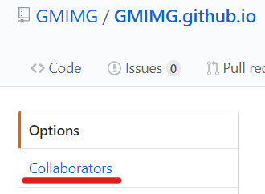
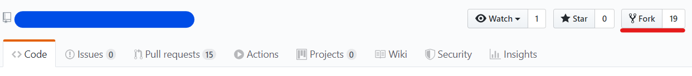
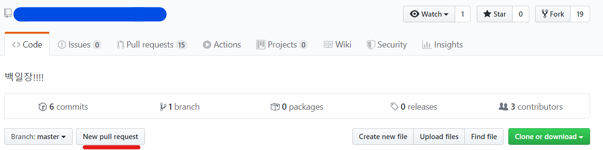
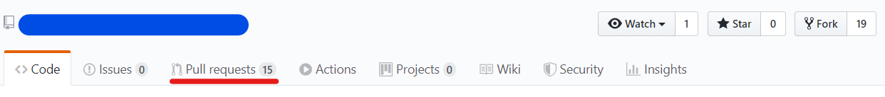
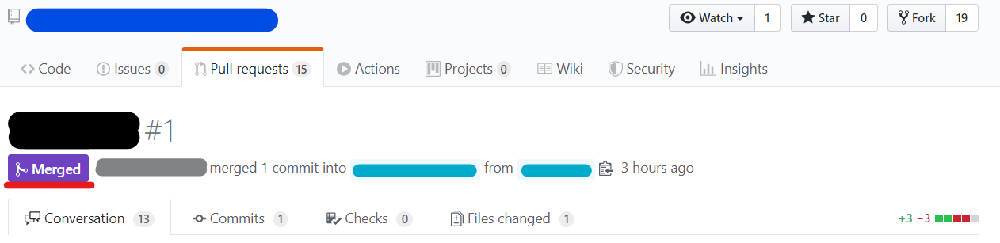
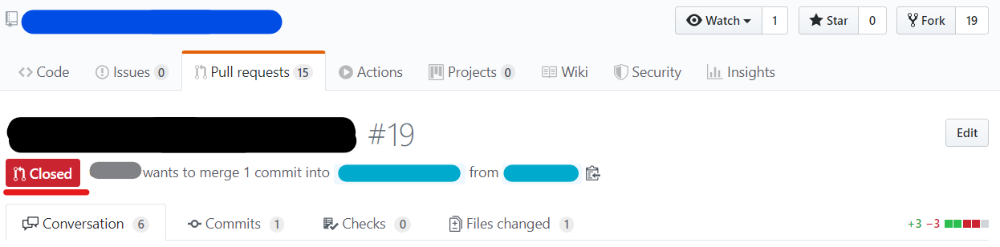

# 2020-08-08-Git

### Git 개념

[Git](https://ko.wikipedia.org/wiki/%EA%B9%83_(%EC%86%8C%ED%94%84%ED%8A%B8%EC%9B%A8%EC%96%B4))은 프로젝트를 진행할 때 사용하는 버전관리시스템이다(흔히 github를 git이라고 부르지만 혼동하지말자). 협업없이 git을 사용한다면 windows에 git을 설치할 때 기본으로 제공되는 git bash를 사용할 수도 있으나 git의 꽃은 협업이므로 다음과같은 git관리 클라이언트를 사용하면 좀더 쉽게 git을 관리할 수 있다. 다만 프로그램별로 지원하는 OS가 다르므로 유의한다. 참고로 bitbucket을 사용한다면 같은 Atlassian 프로그램군을 사용하는게 편리할 것 같다.

| 기능            | MS             | Atlassian  | Axosoft              | etc                      |
| -------------- | -------------- | ---------- | -------------------- | ------------------------ |
| Git repository | github         | bitbucket  |                      | gitlab, Azure DevOps(통합) |
| git gui        | github desktop | Sourcetree | gitkraken            |                          |
| Issue tracker  |                | Jira       | gitkraken glo(별도설치x) |                          |

### Git 설정

전역 영역에서 commit 기록의 주인을 등록

$ git config –global user.name “gmimg”

$ git config –global user.email “[time9300@naver.com](mailto:time9300@naver.com)”

### Git 기본

| git 명령어 | 설명                                         |
| -------- | ------------------------------------------ |
| git init | 해당 디렉토리를 Git이 관리하도록 초기화                    |
| add      | 커밋할 목록에 추가                                 |
| commit   | 커밋(히스토리의 한 단위) 만들기                         |
| push     | 현재까지의 역사(commits)가 기록되어 있는 곳에 새로 생성한 커밋 반영 |
### Git 저장소

로컬(working directory) - staging area - remote repository(github, bitbucket, gitlab)

로컬 컴퓨터 저장소 해당 버전의 스냅샷(기록). 원격 저장소

### Git branch

같은 작업물을 기반으로 동시에 다양한 작업을 할 수 있게 만들어 주는 기능

독립적인 작업 영역 안에서 마음대로 소스코드를 변경할 수 있다. 분리된 작업 영역에서 변경된 내용은 추후에 기존 버전과 비교해서 새로운 하나의 버전을 만들어 낼 수 있다.

## 협업하기

하나의 repository에서 여러사람이 작업할경우 Setting - Collaborators에 등록하면 할 수 있다.

collaborators

Github에서 다른사람의 repository에 Collaborators로 등록되지 않고 기여하고싶을 때가 있다. 특히 유명한 Framework나 library에 Collaborators에 등록되긴 어렵다(Collaborators는 주인의 허락없이 git을 수정할 수 있다).

그럴때엔 **Fork**로 자신의 repository에 긁어온뒤에 코드를 수정한후 push하고 **New pull request**를 통해 원래 repository에 자신의 코드를 pull 요청(comment에 자신이 수정한 부분과 이유를 상세히 설명할수록 좋다)한다.

fork

new_pull_requests

코드변경이 적합하다고 생각하면 원래 repository의 주인은 수락을 해서 원래코드에 merge 해줄거고 그렇지 않다면 댓글을 통해 feedback을 주거나 그 requests를 close할것이다.

pull_requests

merged

closed

Git 잘쓰는 방법

[git 초보를 위한 풀리퀘스트(pull request) 방법](https://wayhome25.github.io/git/2017/07/08/git-first-pull-request-story/)

[Github를 이용하는 전체 흐름 이해하기 #1 :: Outsider's Dev Story](https://blog.outsider.ne.kr/865)

[우린 Git-flow를 사용하고 있어요 - 우아한형제들 기술 블로그](https://woowabros.github.io/experience/2017/10/30/baemin-mobile-git-branch-strategy.html)